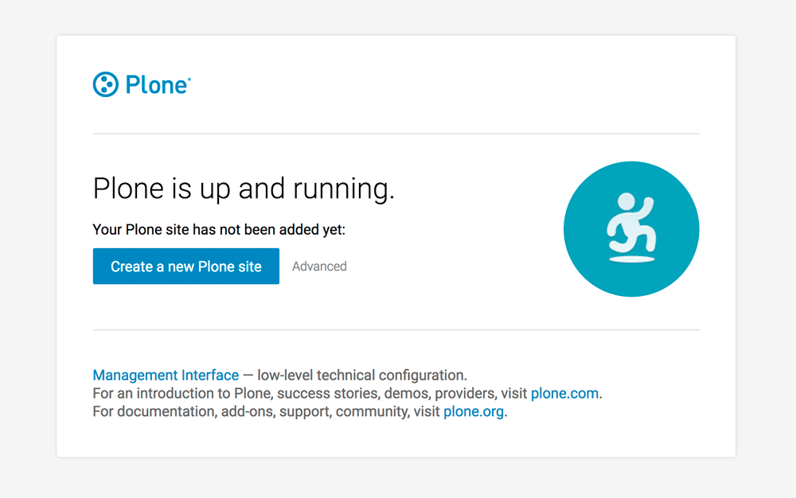
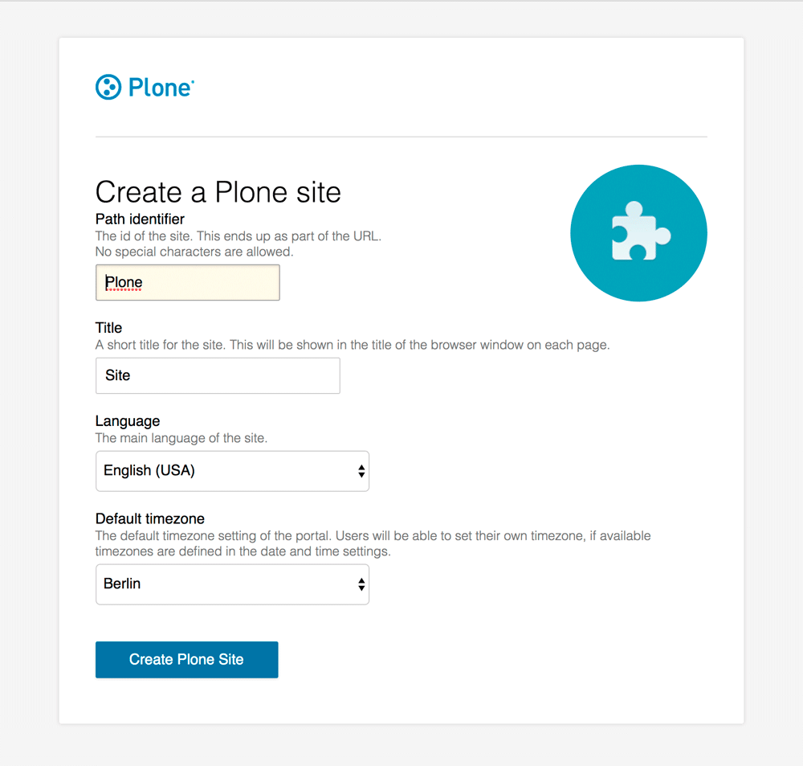
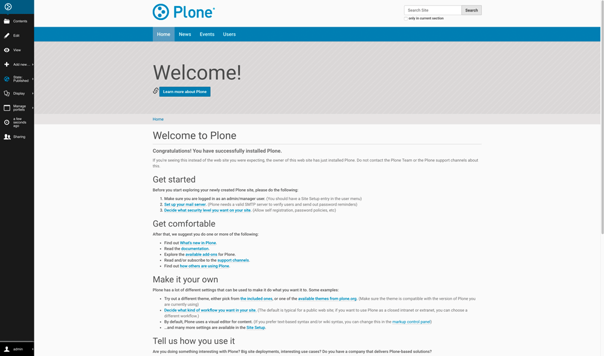

## Plone Installation Instructions 

* Install the Plone application from the BIBBOX store and wait for the logs to stop moving.

* Open up the application by clicking the application tile header in the Applications menu, or the dashboard/logs view.

* If BIBBOX finished the installation of Plone in the system, you will see the first setup screen. Here, click on **Create new Plone site** and enter the default login credentials **admin** / **admin**.

    
    
* You can now choose a **Path identifier** and a **Title** for your page as well as the default **Language**. Finally click the **Create Plone Site** button.

    
    
* After some loading time you will now see the Plone dashboard view and your application is ready to use!

    

## After the installation

Have a nice ride with the new Admins youngtimer.

